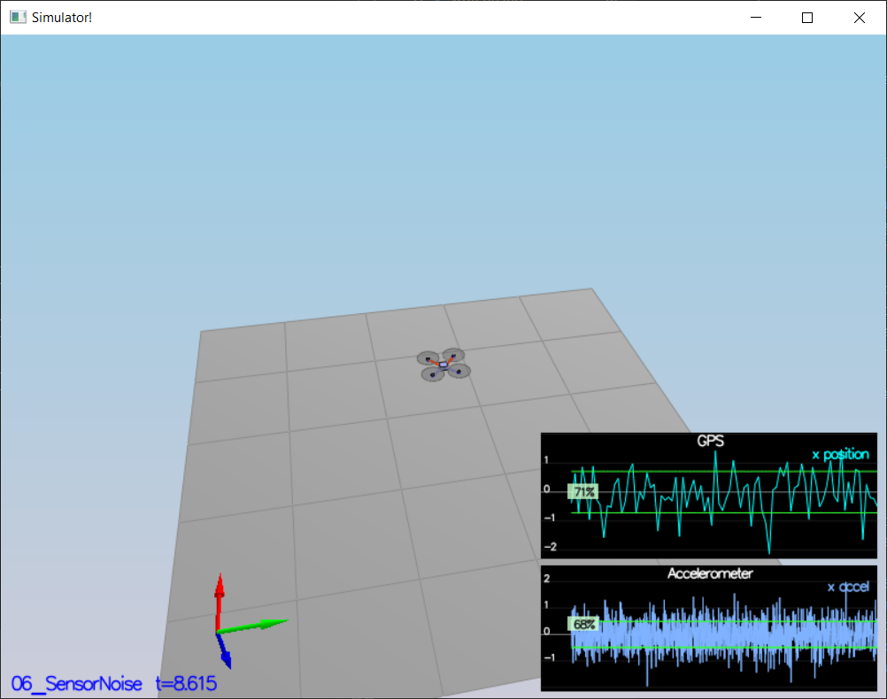
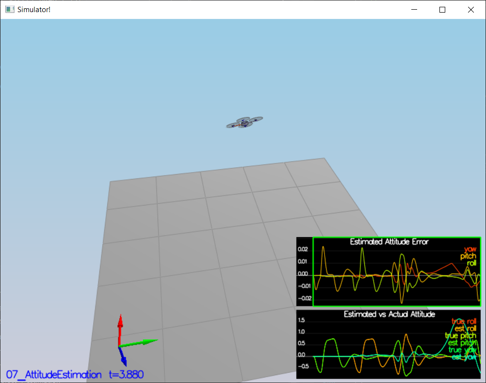
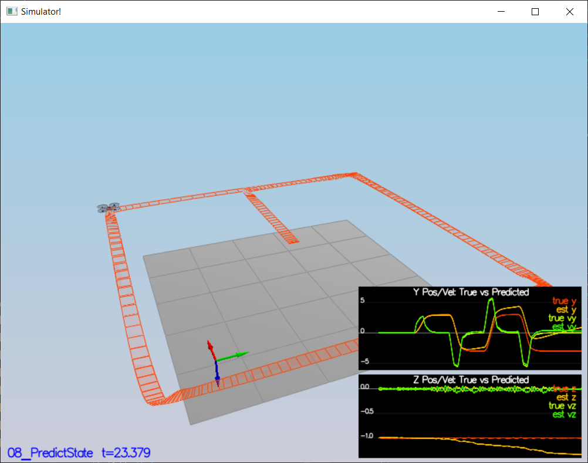
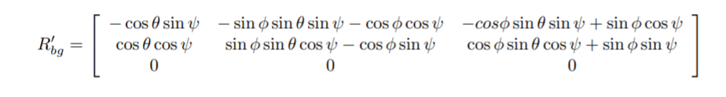
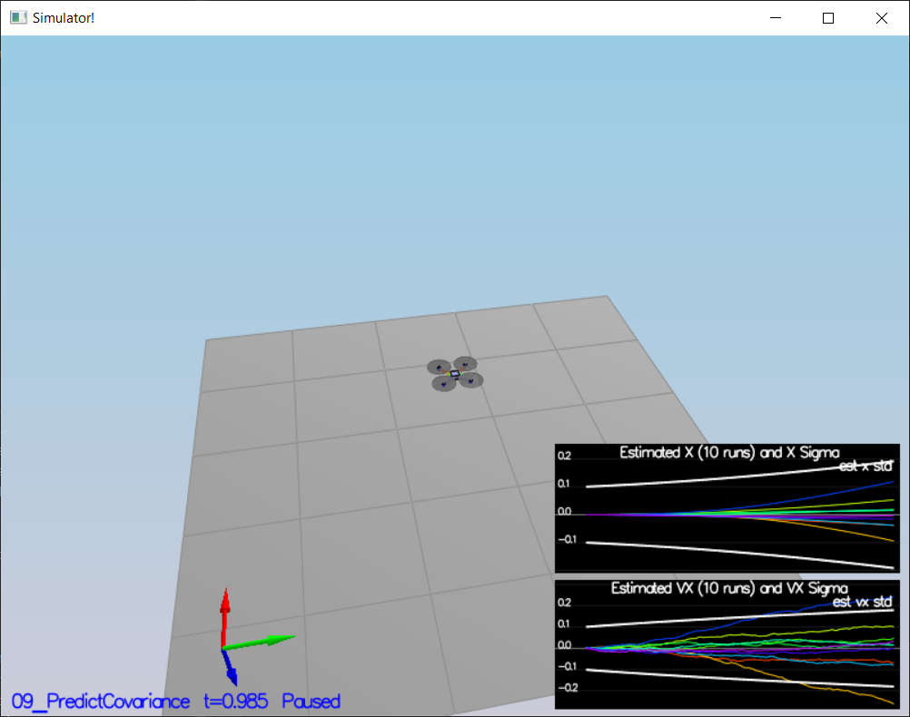
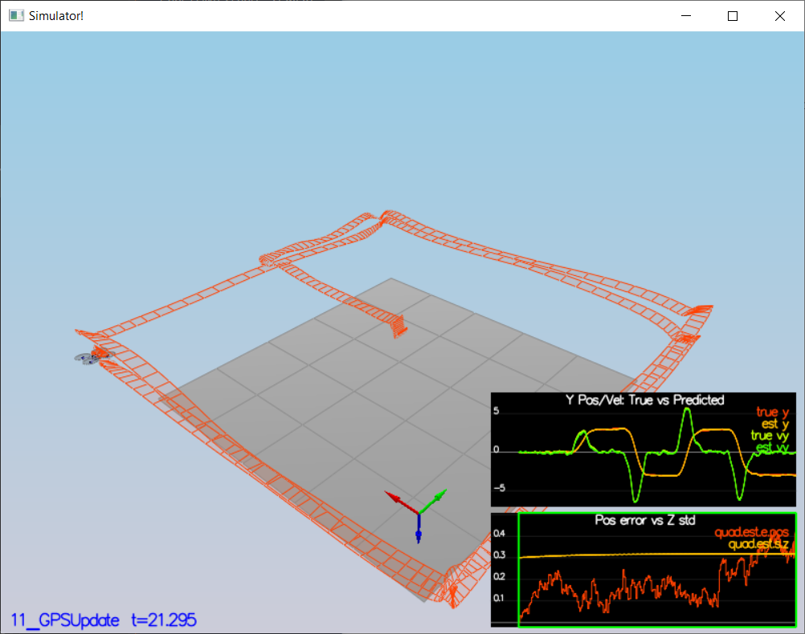

# Project 4: Estimation

## Chris Dalke

In this project, I developed a state estimater for a simulated quadrotor.
The project involves implementing an EKF, which takes in noisy data from sensors to produce an estimation of the true quadcopter position.

## Step 1: Sensor Noise

### 1.2: Calculate Standard Deviation for Sensors
Step 1 asks to compute the standard deviation for the GPS and accelerometer sensors. The `06_NoisySensors` scenario collects log data, which I loaded into a spreadsheet and computed
summary statistics from.

I computed the standard deviation of the two sensors as:
```
GPS: 0.715 M
Accelerometer: 0.495 M/s^2
```

This matches the settings in `SimulatedSensors.txt` of `0.7` for the X/Y GPS position, and `0.5` for X/Y accelerometer values.



## Step 2: Attitude Estimation
To improve the rate gyro attitude integration scheme, I replaced the Euler-angle based scheme with one that uses Quaternions.

First, I convert the Euler angles into a Quaternion using the provided Quaternion implementation:
```
Quaternion<float> currentAttitude = Quaternion<float>::FromEuler123_RPY(rollEst, pitchEst, ekfState(6));
```

Next, I use the built-in function to integrate the body rate, and retrieve the new pitch, roll, and yaw. 

```
currentAttitude.IntegrateBodyRate(V3D(gyro.x, gyro.y, gyro.z), dtIMU);
float predictedPitch = currentAttitude.Pitch();
float predictedRoll = currentAttitude.Roll();
ekfState(6) = currentAttitude.Yaw();
```

While not strictly necessary because the Quaternion math should return the normalized yaw, I left in the code to normalize the yaw to `-pi` to `pi`.

```
//// normalize yaw to -pi .. pi
if (ekfState(6) > F_PI) ekfState(6) -= 2.f*F_PI;
if (ekfState(6) < -F_PI) ekfState(6) += 2.f*F_PI;
```


## Step 3: Prediction Step

### 3.2: Implement State Prediction Step
To implement the state prediction step, I integrate the accelerations and velocities:

```
// Integrate velocities from accelerations
predictedState(3) += accelWorldFrame.x * dt; // Vel X
predictedState(4) += accelWorldFrame.y * dt; // Vel Y
predictedState(5) += accelWorldFrame.z * dt; // Vel Z

// Integrate gravity
predictedState(5) -= 9.81f * dt;

// Integrate positions from velocities
predictedState(0) += predictedState(3) * dt; // Pos X
predictedState(1) += predictedState(4) * dt; // Pos Y
predictedState(2) += predictedState(5) * dt; // Pos Z
```

I also add acceleration due to gravity. In the picture below, you can see the estimator
tracks the actual state with a gradual drift away from the true position.



### 3.4: Implement Prediction Step
The first step to implement prediction is to compute the partial derivative of the body-to-global rotation matrix in `GetRbgPrime`. I implemented this based on the matrix given in figure 52 of Estimation for Quadrotors:



Next, I implemented `Predict`, which predicts the state covariance forward. This involved constructing the transition jacobian and using it, the previous covariance, and Q, the measurement covariance, to compute the new covariance:

```
MatrixXf newCovariance = (gPrime * ekfCov * gPrime.transpose()) + Q;
```

### 3.4: Tune Process Parameters

Next, I ran the covariance prediction and tuned the process parameters `QPosXYStd` and `QVelXYStd` to capture the error dynamics accurately. I found that the following values worked well:

```
QPosXYStd = .1
QVelXYStd = .15
```



## Step 4: Magnetometer Update

### 4.2: Tune Magnetometer Process Parameters

I set `QYawStd = .1` to capture the magnitude of the magnetometer drift. Next, I implemented magnetometer update in `UpdateFromMag`. 

The magnetometer directly reports yaw in the global frame, so the measurement model is very straightforward to implement.

H-prime is a constant matrix: `[0 0 0 0 0 0 1]`:
```
// Build h prime
hPrime(0, 6) = 1;
```

`zFromX`, the measurement prediction, is equal to the yaw from the current state:
```
// Compute measurement prediction from the current state
zFromX(0) = ekfState(6);
```

I added normalization so if the error occurs on the boundary of the circle, the measurement prediction wraps around to prevent the yaw from being updated in the wrong direction:
```
// Compute normalized difference between the measured and estimated yaw
float measuredEstimatedError = z(0) - zFromX(0);
if (measuredEstimatedError > F_PI) zFromX(0) += 2.f * F_PI;
if (measuredEstimatedError < -F_PI) zFromX(0) -= 2.f * F_PI;
```


## Step 5: Closed Loop + GPS Update

In this step, I enabled closed-loop control using noisy sensors and the GPS update. The GPS update step was simple:
The GPS returns absolute positions, so the measurements are not transformed in any way, and the measurement prediction is the current state.

At the same time, I added my own controller (See screenshot below.) I maintained an error <0.5m on the `11_GPSUpdate` scenario.

## Step 6: Adding Your Controller
I copied my code from Project 3 into `QuadControl.cpp` and `QuadControlParams.txt`, replacing the solution code provided by the project. In order to get my controller to work with the estimated state, I detuned the position and velocity control gains by approximately 20%.

